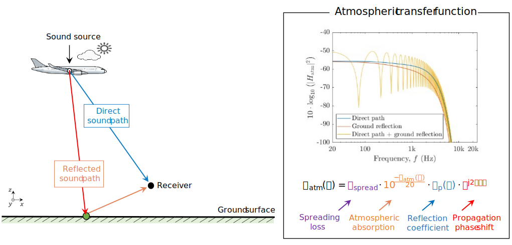

# Framework for aircraft noise auralization 

This repository contains MATLAB scripts that compose a framework for aircraft noise auralization. The framework deals with:

- converting frequency-domain predictions from different partial sound sources of an operational aircraft into sound pressure signals in time domain;
- sound propagation modeling using an open-source ray-tracing software; and 
- combining **sound source descriptions** with **sound propagation effects** to obtain auralized sound pressure signals at receiver positions on the ground.

The framework was developed as part of a PhD research project and is maintained by [Gil Felix Greco](https://www.linkedin.com/in/gil-felix-greco-363985101/).

# 1. Overview

The **auralization framework** can be understood as a tool that transforms sound source descriptions into sound pressure signals at desired receiver positions. On its current form, the framework is particularly tailored to work with aircraft noise predictions provided by the well-established **Parametric Aircraft Noise Analysis Module (PANAM)** [1], an in-house software from the **German Aerospace Center (DLR)**. Nevertheless, it can be easily adapted to auralize other sound sources or handle input data from other modelling tools. 

In the following, a general overview about the framework is provided, of which main components are illustrated in the flowchart below.

## 1.1 Sound source description 

Predictions related to the to the _aircraft trajectory_ and associated _performance_ and _sound emissions_ are provided by **PANAM**. Therefore, the framework does not have any control over the models used to describe the sound source. As illustrated in the figure below, the sound emissions are provided in discrete time-steps (usually of $\Delta t = 0.1$ s), for which directional SPLs associated with a particular receiver position (assuming straight sound path connecting source-receiver pairs) are provided for different componential sound sources, namely: **Airframe noise**, **Engine noise**, **Fan tonal noise** and **Buzzsaw noise**. **Important: sound emissions are provided already including Doppler effect.** 

## 1.2 Sound synthesis

Sound source descriptions are transformed into sound pressure signals in time domain using different techniques from [2]. Signals containing tonal components from the **Fan tonal noise** and **Buzzsaw noise** partial sound sources are obtained using _additive synthesis_. Signals containing broadband noise from the **Airframe noise**, **Engine noise** partial sound sources are obtained using _granular synthesis_. 

At the end of the synthesis procedure, sound signals from all partial sound sources are summed to obtain the overall aircraft noise. An overview of the sound synthesis procedures used to transform the aircraft noise predictions into sound pressure signals is presented in flowchart below.   

## 1.3 Sound propagation modeling 

Sound propagation is modelled based on ray-tracing simulations in combination with different models. The open-source **Atmospheric Ray Tracing (ART)** software [3] is incorporated into the framework to simulate sound paths connecting the source and receiver positions, also known as _eigenrays_. Direct and 1st order reflected eigenrays are considered, for which inputs related to the aircraft trajectory and receiver positions, as well as atmospheric conditions (i.e. temperature, wind, relative humidity, and pressure) are necessary. 

The ART can account for sound _refraction_ and _advection_ caused by sound speed gradients and wind, respectively, allowing for the consideration of inhomogeneous and moving atmospheres (in addition to simplified homogeneous ones), by considering vertical profiles of the atmospheric conditions named previously. Based on the simulated eigenrays, and their associated propagation distances, the following propagation effects are applied: 

- Spreading loss modelled based on Blokhintzev invariant theory [4]
- Atmospheric absorption based on ISO 9613-1:1993
- Spherical-wave reflection coefficient [5], where ground impedance is modelled using the Miki model [6]

Finally, atmospheric transfer functions are established by combining the aforementioned propagation effects and the phase-shift caused by the propagation times of the direct and reflected sound paths. Thereby, the overall attenuation caused by sound propagation effects is described in frequency domain for each combination of source and receiver positions considered within a discrete flight trajectory. The propagation modeling approach through atmospheric transfer functions is illustrated in the figure below. 

## 1.4 Receiver model

The simpliest case is that of an omnidirectional microphone (with 0 dB gain for all frequencies). This is the default case, for which **monoaural diotic** .WAV files are obtained at the receiver positions. A human receiver can also be considered using **Head-Related Transfer Functions (HRTF)** to account for sound propagation effects caused by the interaction of sound with human body parts. In this case, binaural sound signals are rendered using HRTFs from the FABIAN database [7]. 

Only measured HRTFs with zero-degree **Head-above Torso Orientation (HATO)** are considered in this work, meaning the head is aligned with the torso without any additional rotation in yaw, pitch or roll (i.e., looking
straight ahead and not tilted up, down, or to the side, with ears at the same height). By default, the output audio after binaural rendering is **stereo (one channel per ear)**, representing **binaural-dichotic signals** with the receiver assumed to be facing the sound source. The position of the head can be rotated in the horizontal plane if desired.  

## 1.5 Combining source descriptions with sound propagation effects 

To allow for comparison between different cases, first the input aircraft trajectory is trimmed to a desired auralization time around the point on which the aircraft slanted distance from the observer is minimum. Note that, depending on the aircraft trajectory, this is point is not the same as the aircraft overhead position. Thereby, the synthesized signal of the aircraft noise emissions (including Doppler effect) is combined with the transfer functions of the direct and reflected sound paths for each source and receiver pairs considered within the discrete aircraft trajectory to obtain the auralized sound pressure signal at the receiver. This is achieved using the overlap-add method [8] to perform a DFT-based block convolution. 

This process is performed separately for the direct and reflected sound paths. The same sound source signal is used for the direct and reflected ray paths, which differ only by their atmospheric transfer functions. The resulting signals are then summed to yield a **monoaural diotic** auralized sound pressure signal at the receiver. In this case, receiver model = omnidirection microphone. 

If **binaural rendering** is considered, the resulting sound signals for the direct and reflected sound paths are individually convoluted with HRTFs (left and right ears) obtained based on sound incidence angles calculated during the ART simulation. The resulting stereo signals of the direct and reflected sound paths are summed to obtain the auralized sound pressure signals at the receiver for the left and right ears. 

The output signals **(mono or stereo)** are stored as .WAV files, with amplitude in Pascal units or any arbitrary full-scale.

## 1.6 References

[1] L. Bertsch, Noise Prediction within Conceptual Aircraft Design. Doctoral thesis, Technische Universität Braunschweig, 2013. DOI: [10.34912/n0is3-d3sign](https://doi.org/10.34912/n0is3-d3sign)

[2] M. P. Allen, Analysis and synthesis of aircraft engine fan noise for use in psychoacoustic studies. Master thesis, Virginia Polytechnic Institute and State University, 2012

[3] P. Schäfer and M. Vorländer, Atmospheric ray tracing: an efficient, open-source framework for finding eigenrays in a stratified, moving medium, Acta Acust., vol. 5, p. 26, 2021. DOI: [10.1051/aacus/2021018](https://doi.org/10.1051/aacus/2021018)

[4] D. I. Blokhintzev, Acoustics of a nonhomogeneous moving medium, Technical Memorandum (Report no. NACA TM-1399), National Advisory Committee for Aeronautics (NACA), 1956. [https://ntrs.nasa.gov/citations/19930091111](https://ntrs.nasa.gov/citations/19930091111) (Last viewed September 9, 2025)

[5] C. Chien and W. Soroka, A note on the calculation of sound propagation along an impedance surface, J. Sound Vib., vol. 69, no. 2, pp. 340–343, 1980. DOI: [10.1016/0022-460X(80)90618-5](https://doi.org/10.1016/0022-460X(80)90618-5).

[6] Y. Miki, Acoustical properties of porous materials – Modifications of Delany-Bazley models –, J. Acoust. Soc. Jpn. (E), vol. 11, no. 1, pp. 19–24, 1990. DOI: [10.1250/ast.11.19](https://doi.org/10.1250/ast.11.19)

[7] F. Brinkmann, A. Lindau, S. Weinzierl, G. Geissler, S. van de Par, M. Müller-Trapet, R. Opdam, and M. Vorländer, The FABIAN head-related transfer function data base, Data repository, 2020. DOI: [10.14279/depositonce-5718.5](https://doi.org/10.14279/depositonce-5718.5).

[8] F. Wefers, Partitioned convolution algorithms for real-time auralization. Doctoral thesis, RWTH Aachen University, 2014. DOI: [10.18154/RWTH-2015-02185](https://doi.org/10.18154/RWTH-2015-02185).

# 2. Framework architecture / Algorithmic overview

A high-level description of the code structure and input data is provided here.

## 2.1 Input data

-  `auralization_input.dat`: input file from PANAM providing the sound source descriptions for different sound sources, in terms of SPLs over discrete time steps along the aircraft trajectory. Sound emissions are directional, meaning they are provided for each receiver position by considering a straight sound path between the source and receiver, thus incorporating the directivity of the sound sources. Receiver positions and PANAM emission angles are extracted from there.
-  `geschw_hoehe_verlauf.dat.dat`: Input file from PANAM providing the flight trajectory and corresponding operational conditions of the aircraft. Only used for plotting and for simulation of sound propagation using ray-tracing.
-  `input_file.ini`: configuration file providing settings for auralization signal processing and defining the atmospheric properties used in the ray-tracing simulations. The settings used for atmospheric properties follows the same format defined by the ART software.

Exemplary input data is provided in the [input_data](input_data/) folder.

## 2.2 Main functions and data flow

- `auralization_master()` : main interface between input data and auralization functions. Main functions used here are provided in **sequential execution order**:
   - `ini2struct()` : read input file data
   - `PANAM2struct()` : interface between PANAM inputs and matlab. Converts PANAM data into MATLAB structs
   - `create_auralization_results_folder()` : create/define results folder
   - `get_flight_profile()` : get flight trajectory inputs
   - Start receiver loop
      - `prepare_input_SQ()` : trim data based on defined auralization time
      - `MASTER_auralization_EngineAirframe()` : main auralization functions
         - `getTonalInput()` : prepare inputs to auralize tonal noise
         - `tonalSynthesis()` : synthesis of tonal signals, used to auralize **fan harmonics** and **buzzsaw noise**
         - `broadbandSynthesis_smooth()` : functions to convert 1/3-octave band spectrogram into narrowband noise, then get signals using granular synthesis
         - `get_propagation()` : main function resposible to setup and perform sound propagation simulations using the ART software, output atmospheric transfer functions
         - `apply_propagation()` : main function used to apply sound propagation effects on synthesized sound signals of aircraft (emissions + Doppler effect)
            - `get_FIR()` : get **Finite Impulse Response (FIR)** filters associated with atmospheric transfer functions and HRTFs (if required)
            - `overlapp_add_convolution()` : apply FIR in the synthesized signals using the overlapp and add method (i.e., DFT-based block convolution)
         - `save_wav()` : export .WAV files for a desired full-scale 
<!-- >   

Main modules/folders

Core classes/functions

How data flows between them

Include a diagram if possible (flowchart or block diagram).

Optional: brief explanation of algorithmic logic, e.g., how HRTFs are applied, how signals are processed. -->  

# 3. How to use the framework / Quick start

1. Download or clone this repository to your local computer. One way to do that is to press the button 'Code' -> Choose 'Download ZIP' and unzip somewhere).

2. After that, you need to add the relevant folders of the toolbox to the path of your MATLAB. Open and run the `startup_auralization.m` script to automatically perform this task. In order to avoid conflicts, the `startup_auralization.m` needs to be used every time MATLAB is (re)started. Note that third party software used by the framework are distributed (in original form) together with this package in the `third_party` folder. These are automatically installed using the `startup_auralization.m` code.  
   
3. The `run_auralization.m` code provides examples on how to call the auralization framework.
     
<!-- >  Installation instructions (dependencies, setup).

Example scripts or functions for typical workflows.

Input/output formats, including expected signal formats.

Minimal working example (like a “hello world” for your framework). -->  

# 4. References / How to cite this work

This repository hosts the auralization framework developed and verified in the following PhD thesis, where the framework is described in detail together with its verification study and an exemplary application:

> G. Felix Greco, Sound quality analysis of virtual aircraft prototypes: framework development and application. Doctoral thesis, Technische Universität Braunschweig (to be published)

<!-- > This is the main citation if you need to cite the repository itself:

> G. Felix Greco, Sound quality analysis of virtual aircraft prototypes: auralization framework. Software repository, 2025. DOI: [10.5281/zenodo.7934709](https://doi.org/10.5281/zenodo.7934709) -->  

# 5. Licensing

This software is licensed under the **Apache License 2.0**. You are free to use, modify, and distribute this software under the terms of the license.  

See the [LICENSE](LICENSE) file for the full license text.  

## Dependencies

This software is distributed together with several third-party packages and datasets for convenience. All of these components are provided in their **original, unmodified forms** and remain under their own licenses (that is, they are **not necessarely covered by the Apache License 2.0**). For the full license texts and attribution details of these components, please refer to the [`LICENSES.md`](LICENSES.md) file.

# Disclaimer

This repository contains 'work in progress' code for a research project. It is not a completed package or code library. As per the licensing information, the code is published WITHOUT ANY WARRANTY; without even the implied warranty of MERCHANTABILITY or FITNESS FOR A PARTICULAR PURPOSE.

